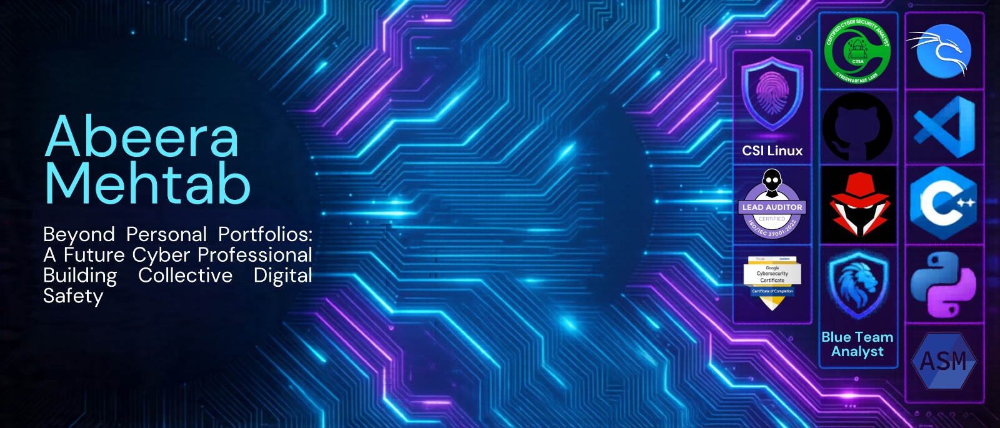
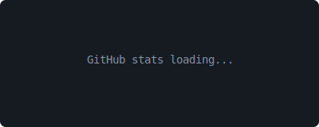
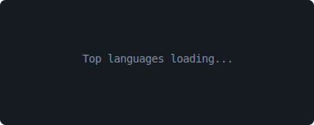
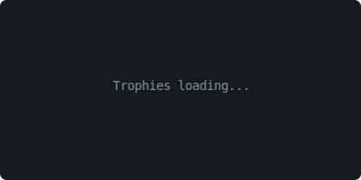

<!-- Banner -->

  

<!-- Title -->
<h1 align="center">Hi 👋, I'm Abeera</h1>
<h3 align="center">aka Aries9</h3>

<!-- Animated Typing Effect -->

  

---

## 📝 About Me

- 🔭 **Working on:** Penetration Testing & Bug Bounty Hunting
- 🌱 **Learning:** Advanced Security Techniques & Secure Software Development
- 💼 **Projects:** Open Source Software & Paid Full Stack Web Development
- 💡 **Passionate about:** Cybersecurity, Ethical Hacking, and Building Secure Applications
- 🎯 **Focus:** Vulnerability Assessment, Web Application Security, and Secure Coding Practices
- 🌍 **Community:** Active Open Source Contributor

---

## 🚀 Languages and Tools I Use

### 🛡️ Cybersecurity & Ethical Hacking Tools

#### Defensive Security

#### Offensive Security

### 💻 Programming Languages

### 🎨 Frontend Development

### ⚙️ Backend Development

### 🤖 AI/ML & Data Science

### 🗄️ Databases

### 🐳 DevOps & Cloud

### 🧪 Frameworks & Testing

### 🖥️ Core Tools

---

## ⚡️ Where to Find Me

  
  
  

---

## 📊 GitHub Stats & Activity

  
  

  

  

